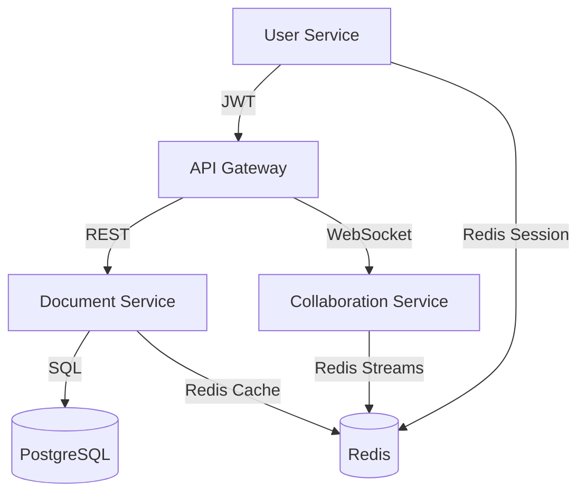

# System Architecture

## Overview
This system is composed of three main microservices (User, Document, Collaboration), an API Gateway, PostgreSQL, and Redis. All services communicate over HTTP/REST or WebSocket, with Redis for event streaming and caching.

## Service Diagram

## Service Interactions
- User Service issues JWTs, manages users
- Document Service validates JWT, manages documents, permissions, search
- Collaboration Service manages real-time editing, broadcasts changes, persists via Document Service
- API Gateway routes requests and proxies WebSocket

## Health & Monitoring
- Each service exposes `/health`
- Logs and metrics can be aggregated 